# Augmented-Reality-Sketch-Authoring
**Proposal:** Begin replicating approach to authoring 3D objects by sketching basic geometric shapes [1]. To do so, I have developed a simpler version based on [2] where a pre-drawn "front" and "side" face sketch are used to reconstruct a 3D object. The information necessary to construct the 3D object is done offline by a server code written in Python. The server sends the information to construct the 3D object to an phone running the AR application which creates the 3D object. Whenever the target image is detected by the AR application, the 3D object is constructed. The user is also presented with various functionality to scale, rotate, and translate the object for better viewing. These functionalities are controlled by button's on the phone screen.

In addition to creating 3D objects from sketches, the server processes the image looking for annotations that can modify the object, for example changing the color or making the front face hollow. These annotations are processed by a segmentation neural network which allows the system to remove the annotations so they do not interfere with the 3D reconstruction process. The 3D segmentation is achieved using Pytorch and U-Net which can be found [here](https://colab.research.google.com/drive/1NC0uj2SfhoQalnspKcLX2T_h6h18V3Cv).

If you would like to see the google colab notebook used to train this model, that can be found [here]().

## Getting started with the code
1. Clone the repository
2. Open up unity hub and add project clicking on the folder. Open clicking on the project Unity should resolve the packages and import necessary scripts.
3. In Unity, open up File/Build Settings/ and switch to Android platform.
4. In terminal, get the public IP address of the machine (On Ubuntu this can be found with ```ifconfig``` I think it is ```ipconfig``` on Windows devices)
5. In server.py and in /Assets/AddSketch.cs change the IP addresss to the one discovered in the last command. Control-F "8080" and you will find the lines.
6. Download the U-Net pre-trained weights from [here](https://drive.google.com/file/d/1lkTS7SnYJCioyHl8XyuUwVvQ685kS84c/view?usp=sharing) and wherever you have cloned your repositoy copy them in the same directory as server.py.
7. Run ```python3 server.py``` to get the server up and going.
8. In Unity, click "File/Build and Run" and install the project.apk into the connected Android device.


For an in-depth look at getting started with Unity and properly setting up the image target which is where the 3D object is reconstructed, please see this medium article that I wrote [here](https://medium.com/@matthew.p.burruss/part-1-sketch3d-turn-your-drawing-into-an-augmented-reality-3d-object-480dae28c0d8).

For an in-depth description of the Python server and AR Android application code, please see this [Medium article](https://medium.com/@matthew.p.burruss/part-2-sketch3d-designing-the-application-3da94f683ee5).

## Demo Video
A demo video can be found [here](https://drive.google.com/open?id=1PCnaRNFSCfgyPdVELxAi60I-inYgCCyF)

## Background

### Sketch-Based Authoring
Sketch based authoring allows a user to add elements, modify existing elements, and manipulate 3D models using sketches which are automatically rendered as 3D objects.

The application has four main components

1. **Image understanding:** Enhances the input image and converts it into its vector-based representations
2. **Structure Reconstruction:** 3D reconstruction based on vector-representation
3. **Scene Composition:** Create the virtual scene
4. **Augment:** Augment the virtual scene with the physical properties

### Segmentation for Annotation Detection, Classification, and Removal

The U-Net neural network architecture is used to segment an 128x128 gray-scaled image of handwritten letters to give a class in the set {0,...,26} to every pixel. The model was trained using categorical cross entropy loss and evaluated using the dice metric. To train the model, the EMNIST data set (28x28 handwritten letters) was modified by placing the character in a 128x128 image at a random location and random scale. Heavy data augmentation was used including randomly drawing geometric items (square, circle, lines, etc.) on the image and changing the thickness and brightness of the image. A realistic paper like background was constructed using OpenCV to help recreate a page.

## Project Introduction

A Python server that serves content to Android client running the AR application written in Unity. An AR application captures sketches of front and side of object to construct. 

Image includes annotations. Currently the following annotations are supported: R (red), G (green), B (blue), H (hollow), clear (C).

Below is an example of the AR interface. The **buttons** on the top allow you to capture a photo of the side and front face sketches. The buttons will turn green once a valid respective side has been captured and stored by the server. Furthermore, the **light gray** box indicates where the target sketch should be located when an image is captured.

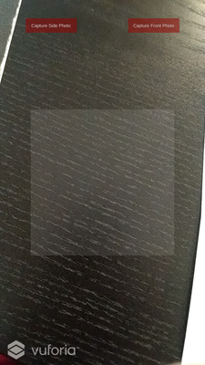

The 3D object, when properly defined, is reconstructed on the image target below.

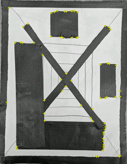

If you have captured images of the side and top and you point the camera of the AR device at the target image above, you will receive the error message below.

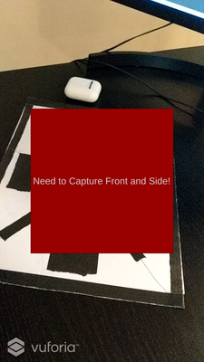

## Example Walkthrough
Let's start with a simple example that shows all aspects of the project: constructing a cube where the sides are colored blue!To begin, we can capture an image of the side of the cube where we have annotated it with "B" to indicate blue.

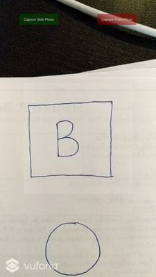

You will then be prompted in the shell running the server to confirm a few things: particularly if the segmentation and the location of the corners of the sketch are correct. Below shows the corner detection and the segmentation prediction on the left and right respectively. Note: For every incorrect segmentation, you must type something other than **y** when prompted to in the server shell. Furthermore, if the corners look incorrect, you can type something other than **y** when prompted to confirm the corner and new corners will be prompted with various sensitivites. If none of the results look good, just try retaking the photo after completing all the prompts.

 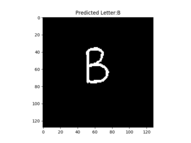

Now we will take a photo of the front. Below shows an example of the sides extracted. The user did not have to confirm the segmentation results because there was no confirmed detected annotation.

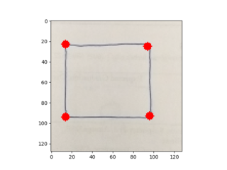 

**End Result** Below shows the end result of the example! You will see that the user can interact with their 3D object by scaling, rotation, and translating along the X, Y, and Z axis.

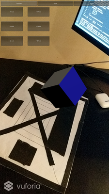 

If you would like to clear all annotation and picture settings, you can take a picture of a c and confirm the segmentation results like below.

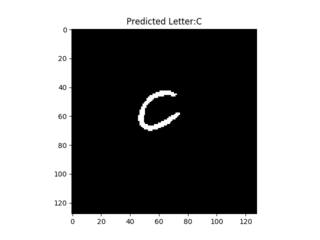 

## Hollow Example
If we annotate with "H" then the front and back face will be removed to make the object hollow. An example of a pentagon with the blue sides from the previous example are shown below.

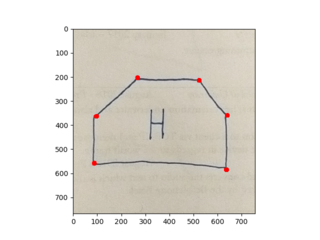 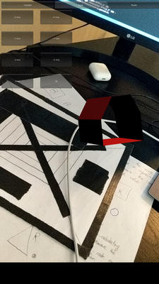 

## Example of 3 point side
The side object must have only 3-4 vertices otherwise it is difficult to assume what was intended. This shows an example of a pyramid which was designed by specifying a green triangle for the side and front.

 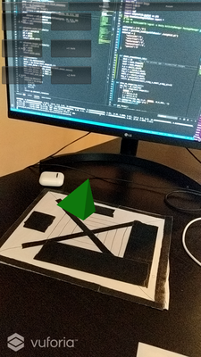 

## Some other non-annotated examples
### Example 1


### Example 2


### Example 3


### Example 4


## Discussion

### Face construction
The most crucial part of the application is the face reconstruction which is performed by the server using openCV image processing. The client constructs the 3D object using a series of co-routines that first communicate to the server to get the information of the object, construct the meshes, and then register the 3D object in the augmented environment.

To construct the faces, the following procedure is followed:

1. Gray scale the image
2. Use OpenCV good features to track algorithm used to detect corners in an image
3. Use OpenCV convexHull() which performs Sklansky’s algorithm to find the convex hull given a set of points
4. Normalize the dimensions of the side and front convex hull.
5. Add a z axis to the side and front convex hull and then rotate the top by 90 degrees along the x axis.
6. Match the bottom of the front hull which is defined by the two lowest vertices to the closest two vertices of the side.
7. Create the back side which is essentially a copy of the front side, scaled by whatever change occurs in the side, and translated according to the length of the side.
8. Construct the faces so that each face is defined by a set of points in a counter-clock wise direction based on how a viewer would look at the faces where the points are defined by the front and back face of the object.
9. Scale the object down so that it is realistically rendered in unity.


### Limitations*

**ISSUE 1:** Example 4 above is an example of the limitation. If the feature detector does not sufficiently cover the front face, then it is possible that the 3D model is incorrectly rendered.

**PARTIAL SOLUTION 1:** When confirming the detection results, if the user says that a detection is poor (too many or too few vertices selected), the algorithm to detect corners is re-run with various sensitivities. If none of these suffice, then the user must re-take the photo. Work can be done in improving the base algorithm to detect corners.

**ISSUE 2:** Inaccurate segmentation

**PARTIAL SOLUTION 2:** The model that is provided pre-trained is actually pretty decent. To help reduce false-positives, the user most only confirm segmentation results of a sufficient size that match letters of interest like R, G, B, or H. Any other segmentation results are ignored. These results are important because the system must remove the annotation before finding corners of the shape. Each individual segmentation mask that is confirmed is used to remove corners. When confirming the corner detection, you are confirming the results after removing any corners that overlapped the mask with some margin of error.

**ISSUE 3:** Only one sketch supported at a time and only one person can use the server

**PARTIAL SOLUTION 3:** This is by no means a commercial solution and currently the server can only support a single user. Obviously, one can easily extend this to many users and also support the generation of multiple AR objects. The first is likely easier to accomplish than the second because the communication protocol would need to change to support multiple objects as well as the AR interface for capturing the front and side photo of the object we are trying to create.

## Final Project: Not static content, textures, colors, annotations
1. ~~Ability to colors with annotations~~
2. ~~Use a neural network to detect specific annotations~~
3. ~~Make it hollow using an annotation~~
4. ~~Support real-time generation of objects using camera on phone to capture image, send to server, server processes, and sends it back... requires taking image of front and side~~

## Possible Future Additions
1. Support multiple authored objects
2. Ability to edit the authored models
3. Add properties to objects like friction

# Citations
[1] Banu, Simona Maria. "Augmented Reality system based on sketches for geometry education." 2012 International Conference on E-Learning and E-Technologies in Education (ICEEE). IEEE, 2012.

[2] Bergig, Oriel, et al. "In-place 3D sketching for authoring and augmenting mechanical systems." 2009 8th IEEE International Symposium on Mixed and Augmented Reality. IEEE, 2009.

[3] Ronneberger, Olaf, Philipp Fischer, and Thomas Brox. "U-net: Convolutional networks for biomedical image segmentation." International Conference on Medical image computing and computer-assisted intervention. Springer, Cham, 2015.
